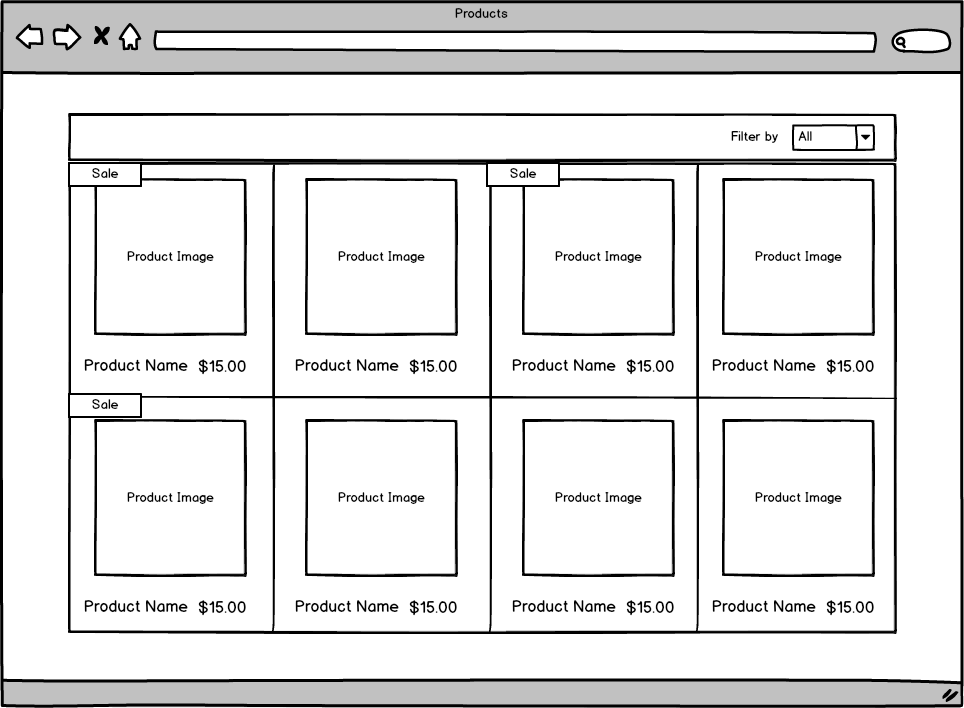

# Products Application

This is a frontend application for viewing prodcucts. In this application, as a user, he/she can see a range of products and filter products based on the product type.

For more details, please refer to [instructions](instructions.md)

## Wireframe



## Technology Stack

- Language: `JavaScript`
- Framework: `React`
- Middleware: `Saga`
- UI Library: `Material UI`
- Unit test: `Testing Library`

## Code Structure

```bash
products-app
├── src                             <-- Source code for this application
│   ├── __tests__                   <-- All unit tests
│   ├── components                  <-- All web components
│   │   └── Products.js             <-- Product container component
│   │   └── ProductItem.js          <-- Every Product details component
│   │   └── Filter.js               <-- Filtering different types of products
│   ├── redux                       <-- State management
│   │   └── actions                 <-- Include action types and action creators
│   │   └── reducers                <-- Update application state
│   │   └── store.js                <-- Hold the whole state tree of the application
│   ├── constants                   <-- Constant values for this application
│   ├── sagas                       <-- Middleware to handle calling server API
├── App.js                          <-- Main layout
├── index.js                        <-- Entry of the application
├── package.json                    <-- NodeJS dependencies and scripts
├── jsconfig.json                   <-- JavaScript config file
├── README.md                       <-- Instructions
└
```

## Command Lines

- `npm install` installs dependencies.
- `npm start` is for running the application
- `npm test` is for unit testing.
- `npm run test -- --coverage --watchAll=false` is for running unit test with coverage report.
